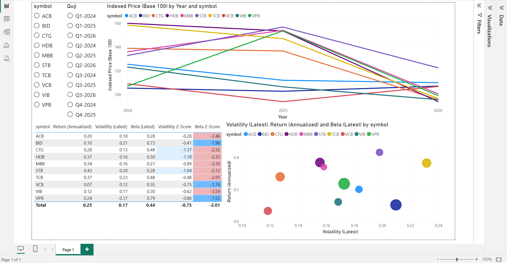

# Phân tích Hiệu suất & Rủi ro Nhóm Cổ phiếu Ngân hàng Niêm yết Việt Nam

**Công nghệ sử dụng:** Python (vnstock) · PostgreSQL · Power BI

## 1. Bối cảnh & Câu hỏi kinh doanh

### Bối cảnh
Nhóm cổ phiếu ngân hàng là một trong những nhóm ngành vốn hóa lớn nhất trên thị trường chứng khoán Việt Nam và có ảnh hưởng đáng kể đến xu hướng chung của VN-Index. Với nhà đầu tư cá nhân, việc phân biệt được mã nào tăng trưởng bền vững và mã nào tăng trưởng đi kèm rủi ro cao là bài toán thực tế, có giá trị ứng dụng trực tiếp cho quyết định đầu tư.

### Phạm vi dữ liệu

**Mã cổ phiếu (10 mã, 2 nhóm):**

| Nhóm | Mã | Ngân hàng |
|---|---|---|
| Quốc doanh | VCB | Ngân hàng TMCP Ngoại thương Việt Nam |
| Quốc doanh | BID | Ngân hàng TMCP Đầu tư và Phát triển Việt Nam |
| Quốc doanh | CTG | Ngân hàng TMCP Công Thương Việt Nam |
| Tư nhân | TCB | Ngân hàng TMCP Kỹ thương Việt Nam |
| Tư nhân | ACB | Ngân hàng TMCP Á Châu |
| Tư nhân | MBB | Ngân hàng TMCP Quân đội |
| Tư nhân | VPB | Ngân hàng TMCP Việt Nam Thịnh Vượng |
| Tư nhân | HDB | Ngân hàng TMCP Phát triển TP.HCM |
| Tư nhân | STB | Ngân hàng TMCP Sài Gòn Thương Tín |
| Tư nhân | VIB | Ngân hàng TMCP Quốc tế Việt Nam |

**Khung thời gian:**
- Dữ liệu giá & khối lượng: 02/01/2024 (phiên giao dịch đầu tiên năm 2024) - 09/07/2026
- Dữ liệu tài chính theo quý (P/E, ROE, EPS, NIM): Q1/2024 - Q1/2026

> **Lưu ý về mốc thời gian dữ liệu tài chính quý:** Dữ liệu tài chính quý (P/E, ROE, EPS, NIM) chỉ lấy đến Q1/2026, không lấy đến quý hiện tại như dữ liệu giá. Lý do: BCTC quý của công ty mẹ (như các ngân hàng, do có công ty con) được phép công bố tối đa 45 ngày sau khi quý kết thúc, nên tại thời điểm thu thập dữ liệu, quý gần nhất chưa chắc đã có đủ báo cáo cho cả 10 mã.

**Nguồn dữ liệu:** thư viện `vnstock` (Python) - giá đóng cửa & khối lượng giao dịch hàng ngày, chỉ số tài chính theo quý, dữ liệu VN-Index để tính beta.

### Câu hỏi kinh doanh

**Câu hỏi chính:**
Trong 10 mã cổ phiếu ngân hàng niêm yết (VCB, BID, CTG, TCB, ACB, MBB, VPB, HDB, STB, VIB) từ Q1/2024 đến nay, mã nào đang có lợi nhuận (return) cao nhưng đi kèm mức độ biến động (volatility) và rủi ro hệ thống (beta) tăng bất thường?

**Câu hỏi phụ:**
1. Biến động của nhóm cổ phiếu ngân hàng tăng/giảm rõ rệt nhất vào giai đoạn nào trong khung thời gian phân tích, và điều này có trùng với các sự kiện vĩ mô (thay đổi lãi suất, chính sách tín dụng) không?
2. Nhóm ngân hàng quốc doanh (VCB, BID, CTG) có hồ sơ rủi ro/lợi nhuận khác biệt như thế nào so với nhóm ngân hàng tư nhân (TCB, ACB, MBB, VPB, HDB, STB, VIB)?

### Vì sao câu hỏi này quan trọng
Kết quả phân tích hướng tới nhóm đối tượng là nhà đầu tư cá nhân hoặc bộ phận research của công ty chứng khoán - những người cần xác định mã nào phù hợp khẩu vị rủi ro nào, thay vì chỉ nhìn return đơn thuần. Từ đó hỗ trợ quyết định phân bổ danh mục: mã nào nên đưa vào danh mục phòng thủ, mã nào phù hợp chiến lược chấp nhận rủi ro cao hơn để đổi lấy tăng trưởng.

## 2. Thu thập dữ liệu
### Nguồn dữ liệu
- KBS (qua thư viện vnstock) - chọn nguồn này vì cung cấp đủ 4 chỉ số cần thiết (P/E, ROE, EPS, NIM), bao gồm cả NIM vốn là chỉ số đặc thù ngân hàng mà không phải nguồn nào cũng có sẵn.
- Giá KBS trả về là giá đã điều chỉnh (adjusted). Không cần tự xử lý điều chỉnh do chia tách/cổ tức
### Phạm vi thực tế đã lấy được
- Giá & khối lượng: 02/01/2024 - 09/07/2026, lấy được đủ 10 mã
- Chỉ số tài chính quý: chỉ lấy được 4 quý gần nhất
- VN-Index: 02/01/2024 - 09/07/2026
### Vấn đề gặp phải khi thu thập & cách xử lý
- Giới hạn 4 quý gần nhất ở dữ liệu tài chính (gói miễn phí): quyết định thu hẹp vai trò của nhóm chỉ số này thành "bức tranh fundamentals hiện tại" bổ trợ cho phân tích return/volatility/beta (dựa hoàn toàn trên dữ liệu giá)
- Giá trả về ở đơn vị nghìn VND: quy đổi về VND đầy đủ khi nạp vào PostgreSQL
- `trailing_eps` là EPS trượt 4 quý gần nhất (TTM), không phải EPS riêng từng quý
- Cột `2025-Q4_1` trong `ratio()` nghi là bản báo cáo trùng quý (có thể là bản đã soát xét) - để nguyên ở dữ liệu thô, xử lý sau
### Định dạng & vị trí lưu trữ
- Parquet, thư mục `raw/{price, financial, index}/`, đặt tên file theo mã cổ phiếu

## 3. Thiết kế & khởi tạo database
### Thiết kế schema
- Mô hình star schema, gồm 3 bảng: `dim_company`, `fact_price_daily`, `fact_financial_quarterly`
- Hai bảng staging trung gian: `staging_price_raw`, `staging_financial_raw`.

### Các bảng
- `dim_company` - danh sách 10 mã ngân hàng + VNINDEX, phân loại quốc doanh/tư nhân
- `fact_price_daily` - giá & khối lượng theo ngày, unique theo (company_id, trade_date)
- `fact_financial_quarterly` - chỉ số tài chính theo quý, dạng long (mỗi dòng 1 chỉ số), unique theo (company_id, year, quarter, ratio_id)
- `staging_price_raw`, `staging_financial_raw` - bảng trung gian, không ràng buộc, giữ đúng dữ liệu thô trước khi làm sạch.

### Quyết định thiết kế đáng chú ý
- VNINDEX được model như 1 dòng trong `dim_company` (`is_index = TRUE`) thay vì tách bảng riêng, để có thể join `fact_price_daily` theo `company_id` thống nhất khi tính beta, không cần xử lý đặc biệt cho index
- `fact_financial_quarterly` dùng dạng long (EAV: `ratio_id`/`ratio_value` theo dòng) thay vì 1 cột riêng cho từng chỉ số - đánh đổi lấy sự linh hoạt khi số lượng/loại chỉ số có thể khác nhau giữa các kỳ, chấp nhận cần pivot khi truy vấn

Script tạo bảng: xem `sql/create_tables.sql`.

### Nạp dữ liệu thô vào staging
- `staging_price_raw`: 6.250 dòng (10 mã) + 625 dòng (VNINDEX) - khớp đúng 10 mã × 625 phiên giao dịch, xác nhận không mã nào thiếu dữ liệu
- `staging_financial_raw`: 1.280 dòng - khớp đúng 10 mã × 32 chỉ số × 4 quý
- Script: `scripts/load_staging.py`.

## 4. Làm sạch dữ liệu bằng SQL
### Nạp dim_company
Nạp 10 mã ngân hàng + VNINDEX vào `dim_company`, phân loại `group_type` (Quốc doanh: VCB, BID, CTG / Tư nhân: TCB, ACB, MBB, VPB, HDB, STB, VIB) và đánh dấu `is_index = TRUE` cho VNINDEX để phục vụ tính beta sau này.

### Transform staging → fact
- `fact_price_daily`: nhân giá với 1000 để quy đổi từ nghìn VNĐ sang VNĐ cho 10 mã cổ phiếu, giữ nguyên giá trị cho VNINDEX (vì là điểm số, không phải tiền tệ).
- `fact_financial_quarterly`: tách `quarter_label` (VD `2025-Q4_1`) thành `year`/`quarter`, gộp các quý trùng nhau.

Cả 2 câu INSERT dùng `ON CONFLICT DO NOTHING` để có thể chạy lại an toàn khi nạp thêm dữ liệu mới mà không bị lỗi trùng khóa.

### Xử lý bản ghi trùng quý (`_1` suffix)
Khi 1 mã có cả `YYYY-Qn` và `YYYY-Qn_1` cho cùng chỉ số, ưu tiên giữ bản `_1` (giả định là bản công bố sau/đã điều chỉnh, dựa trên quy ước đặt tên của nguồn KBS - nguồn không cung cấp cờ trạng thái kiểm toán đáng tin cậy để xác nhận). Đối chiếu giá trị giữa 2 bản (mẫu: ACB, Q4/2025) cho thấy phần lớn chỉ số có giá trị khác nhau thật sự (beta, BVPS, CIR, tiền gửi khách hàng...), chỉ một số chỉ số mang tính cấu trúc ổn định (vốn điều lệ, tỷ suất cổ tức) trùng khớp - xác nhận đây là 2 phiên bản báo cáo khác nhau thật, không phải bản ghi trùng lặp do lỗi kỹ thuật. Vẫn là giới hạn của phân tích: không có xác nhận chính thức bản nào là bản cuối/đã kiểm toán.

### Kiểm tra chất lượng dữ liệu (`sql/validation_checks.sql`)
| Hạng mục | Kết quả |
|---|---|
| Giá trị NULL (giá, volume, ratio_value) | Không có - 0 dòng NULL ở cả `fact_price_daily` và `fact_financial_quarterly` |
| Trùng lặp (company_id, trade_date) và (company_id, year, quarter, ratio_id) | 0 dòng - UNIQUE constraint đã chặn từ lúc insert |
| Khoảng trống ngày giao dịch bất thường (gap > 4 ngày) | Có 9 mốc gap (5-10 ngày), nhưng **tất cả xảy ra đồng loạt ở toàn bộ 10 mã + VNINDEX cùng ngày** - khớp với các dịp nghỉ lễ đã biết: Tết Nguyên Đán (2024, 2025, 2026), nghỉ 30/4-1/5 (2024, 2025, 2026), Quốc khánh 2/9 (2024, 2025), Tết Dương lịch 2026. Không phát hiện gap bất thường riêng lẻ ở mã nào → dữ liệu đầy đủ, không thiếu phiên giao dịch nào ngoài dự kiến |
| Giá/volume âm | Không có - 0 dòng vi phạm |
| Logic OHLC (high ≥ open/close/low, low ≤ open/close/high) | Không có vi phạm |
| Số dòng giá mỗi mã | Đủ 625 dòng/mã (khớp log fetch ở bước 2) |
| Số quý tài chính mỗi mã | 3 quý (Q3/2025, Q4/2025, Q1/2026) - đúng như kỳ vọng, vì `2025-Q4` và `2025-Q4_1` đã gộp về cùng 1 quý theo quyết định xử lý trùng lặp ở trên |

Script SQL: `sql/transform_to_fact.sql` (nạp dim + transform fact), `sql/validation_checks.sql` (kiểm tra chất lượng).

## 5. Xây dựng metric layer

Xây dựng 5 view SQL để tính các chỉ số phân tích, tách riêng khỏi bảng fact gốc để dễ tái sử dụng cho Power BI và phân tích:

| View | Công thức | Ghi chú |
|---|---|---|
| `v_daily_return` | `(close_hôm_nay - close_hôm_qua) / close_hôm_qua` | Dùng `LAG()`, áp dụng cho cả 10 mã và VNINDEX |
| `v_volatility_20d` | Độ lệch chuẩn (STDDEV_SAMP) của daily return trên cửa sổ trượt 20 phiên | Có thêm cột annualized (× √252). 19 phiên đầu mỗi mã NULL hoá tường minh (chưa đủ 20 phiên) |
| `v_beta_60d` | `REGR_SLOPE(return_cổ_phiếu, return_VNINDEX)` trên cửa sổ trượt 60 phiên | Dùng hàm hồi quy tuyến tính có sẵn của PostgreSQL, join theo `trade_date` với return của VNINDEX. Không tính cho VNINDEX (beta so với chính nó không có ý nghĩa). 59 phiên đầu mỗi mã NULL hoá tường minh |
| `v_moving_average` | Trung bình cộng giá đóng cửa trên cửa sổ trượt 50/200 phiên | MA50/MA200 của các phiên đầu mỗi mã (chưa đủ 50/200 phiên lịch sử) được NULL hoá tường minh, không tính trên cửa sổ ngắn hơn - tránh hiển thị số liệu gây hiểu nhầm |
| `v_metric_layer` | Gộp 4 view trên theo `(company_id, trade_date)` | View tổng hợp duy nhất, dùng làm nguồn kết nối trực tiếp cho Power BI ở bước 6; loại VNINDEX, chỉ giữ 10 mã ngân hàng |

Script SQL: `sql/metrics_views.sql`

### Kiểm tra hợp lý (sanity check)
Đối chiếu độc lập bằng Python (`pandas`, `numpy.polyfit`) cho mã **VCB**: lấy dữ liệu thô từ `fact_price_daily`, tự tính lại volatility và beta ngoài SQL, so sánh với kết quả view.

| Chỉ số | Kết quả SQL (view) | Kết quả Python (độc lập) | Kết luận |
|---|---|---|---|
| volatility_20d | 0.118365 | 0.11836488... | Khớp |
| beta_60d | 0.353224 | 0.35322393... | Khớp |
| daily_return | - | - | Không kiểm chứng riêng - là input trực tiếp của 2 phép tính trên, đã gián tiếp xác nhận đúng |

## 6. Xây dựng dashboard Power BI

### Kết nối
Power BI Desktop kết nối trực tiếp tới PostgreSQL qua view `v_metric_layer`

Script DAX: `dax/measures.dax`

### Các visual đã xây dựng
| Visual | Loại | Mục đích |
|---|---|---|
| Indexed Price (Base 100) by Year and symbol | Line chart | So sánh hiệu suất tương đối giữa 10 mã (chuẩn hóa về mốc 100 tại ngày đầu tiên) |
| Bảng xếp hạng (symbol, Return, Volatility, Beta, Z-Score) | Table + conditional formatting | Xếp hạng và cảnh báo mã có Z-Score bất thường (đỏ/vàng theo ngưỡng độ lệch chuẩn) |
| Volatility vs Return vs Beta | Scatter/Bubble chart | Trực quan hóa quan hệ rủi ro-lợi nhuận, kích thước bubble thể hiện Beta |

### Bộ lọc
Slicer theo `symbol` và theo quý (`Quý`), áp dụng lên toàn bộ visual trên dashboard.

### Đối chiếu với câu hỏi kinh doanh
| Câu hỏi | Trạng thái |
|---|---|
| Câu hỏi chính: mã nào return cao nhưng volatility/beta tăng bất thường | Trả lời được qua scatter chart + Z-Score trong bảng |
| Câu hỏi phụ #1: giai đoạn biến động rõ rệt nhất, trùng sự kiện vĩ mô? | Chưa - mở rộng sau |
| Câu hỏi phụ #2: so sánh nhóm quốc doanh vs tư nhân | Chưa - mở rộng sau |

## 7. Insight & Recommendation

### Phát hiện chính
- **Không mã nào có Z-Score dương** (cả Volatility và Beta) tại thời điểm phân tích - nghĩa là không mã nào đang biến động/nhạy cảm thị trường cao bất thường so với lịch sử chính nó. Câu hỏi kinh doanh chính do đó được trả lời theo hướng **tương đối** (so sánh giữa 10 mã) thay vì "bất thường tuyệt đối".
- **STB** có return cao nhất (0.43) trong khi beta thấp (0.28) - hồ sơ lợi nhuận cao nhưng độ nhạy thị trường thấp, khá hiếm trong nhóm.
- **TCB** có return cao (0.37) đi kèm volatility cao nhất trong nhóm (0.23) - cặp return/risk cao rõ ràng nhất, gần đúng với mô tả "return cao đi kèm rủi ro tăng" mà câu hỏi kinh doanh tìm kiếm, dù chưa ở mức bất thường theo Z-Score.
- **BID** đáng chú ý theo hướng ngược lại: return thấp (0.10) nhưng beta cao nhất nhì nhóm (0.73) - lợi nhuận không tương xứng với mức độ nhạy cảm thị trường phải gánh.
- **VCB** có return thấp nhất (0.07) và volatility thấp nhất (0.12) - hồ sơ phòng thủ điển hình, ổn định nhưng tăng trưởng chậm.

### Nhận định theo nhóm
| Nhóm | Return TB | Volatility TB | Beta TB | Nhận định |
|---|---|---|---|---|
| Quốc doanh (VCB, BID, CTG) | ~0.15 | ~0.15 | ~0.52 | Return thấp hơn nhóm tư nhân, nhưng beta trung bình cao hơn (chủ yếu do BID) - hồ sơ rủi ro/lợi nhuận kém hấp dẫn hơn so với tư nhân trong khung thời gian này |
| Tư nhân (TCB, ACB, MBB, VPB, HDB, STB, VIB) | ~0.30 | ~0.18 | ~0.41 | Return trung bình cao hơn rõ rệt, biến động chỉ nhích nhẹ - nhóm tư nhân hiện có hồ sơ rủi ro/lợi nhuận tốt hơn nhóm quốc doanh |

*Lưu ý: VPB (beta 0.79) là ngoại lệ trong nhóm tư nhân, kéo beta trung bình nhóm lên - nếu loại VPB, beta trung bình nhóm tư nhân sẽ thấp hơn nữa, làm khoảng cách với nhóm quốc doanh càng rõ.*

### Khuyến nghị hành động
1. **Danh mục phòng thủ:** VCB, ACB (return khá + volatility/beta thấp) phù hợp nhà đầu tư ưu tiên ổn định.
2. **Danh mục tăng trưởng, chấp nhận rủi ro cao hơn:** STB, TCB, HDB - return cao nhất trong nhóm; TCB cần theo dõi sát hơn do volatility cao nhất.
3. **Cần xem xét lại:** BID - beta cao nhưng return không tương xứng, tỷ lệ đánh đổi rủi ro/lợi nhuận kém hấp dẫn so với các mã khác trong cùng nhóm quốc doanh.
4. **Theo dõi định kỳ:** vì hiện tại chưa có mã nào ở vùng Z-Score bất thường (≥ 2 hoặc ≤ -2 theo hướng dương), khuyến nghị dashboard này nên được cập nhật định kỳ (hàng tuần/tháng) để bắt kịp thời điểm nếu có mã chuyển sang vùng rủi ro cao bất thường.

### Giới hạn
- Nhận định dựa trên dữ liệu tại thời điểm 09/07/2026, chưa phản ánh biến động theo mùa/quý.
- Nhóm so sánh quốc doanh/tư nhân chỉ có 3 mã quốc doanh - kích thước mẫu nhỏ, một mã ngoại lệ (BID) có thể ảnh hưởng lớn tới trung bình nhóm.